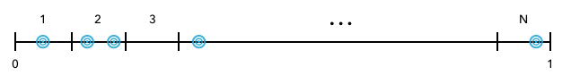

```{r include = FALSE}
knitr::opts_chunk$set(eval = TRUE, echo = TRUE)
```

> Estimando o número $e$ via Simulação de Monte Carlo


## Instruções:

----

1. Todos os membros da equipe devem trabalhar conjuntamente (versus alternadamente por indivíduos que compõe a equipe) na resolução do desafio.

1. Diferentes equipes **NÃO** deverão discutir ou compartilhar métodos de resolução de problemas ou códigos.

1. Os relatórios serão avaliados com relação à (i) reprodutibilidade; (ii) correção; e (iii) completude da solução proposta, devendo incluir:

  + Enunciado do problema  
  + Apresentação da estratégia de solução  
  + Resultados (resumos numéricos e gráficos)  
  + Análise dos resultados obtidos  
  + Código R comentado  
  + Referências (textos, sites etc.)

**OBS:**  
Existe um volume enorme de código disponível na internet para resolver praticamente qualquer problema. O reuso de código obtido online é permitido, desde que citada a fonte (mesmo que tenha sido utilizada apenas como inspiração...)


**Prazo: 16/08/2019**

**Entregáveis:**

+ Todos os arquivos utilizados para realizar a tarefa, organizados em uma pasta, seguindo o modelo:  
```
[Turma-22-X1]_[Nome-Aluno-1]__[Turma-22-X2]_[Nome-Aluno-2]_S02
  |-data
  |-img
  |-[Turma-22-X1]_[Nome-Aluno-1][Turma-22-X2]_[Nome-Aluno-2]_S02.html
  |-[Turma-22-X1]_[Nome-Aluno-1][Turma-22-X2]_[Nome-Aluno-2]_S02.Rmd
```  
+ Adicionar a pasta no diretório do Drive:
```
MOQ13-201 [ALUNOS] > Material-do-Curso > S02 > Relatorios
```


## Introdução

----

Sem dúvida, os dois números transcedentais mais importantes são $\pi$ e o [número de Euler,  e](https://en.wikipedia.org/wiki/E_(mathematical_constant)). Existem várias maneiras de calcular os valores de tais constantes, sendo as mais famosas baseadas em expansões em séries de Taylor:

$$
  \frac{\pi}{4} =  1 - \frac{1}{3} + \frac{1}{5} - \frac{1}{7} + \frac{1}{9} - \ldots
$$

$$
  e = \frac{1}{0!} + \frac{1}{1!} + \frac{1}{2!} + \frac{1}{3!} + \ldots 
$$

Vimos em sala que é possível estimar o valor da constante $\pi$ através de um experimento aleatório (problema da Agulha de Buffon), implementado em uma simulação de Monte Carlo. 

Neste exercício, vamos aprender uma maneira estocástica de estimar o número $e$.

## PARTE 1: Solução Analítica

----

Consideremos o seguinte experimento aleatório (jogo de dardos unidimensional):

`N` dardos são lançados de maneira arbitrária em uma linha de comprimento unitário, subdividida em `N` segmentos de mesmo comprimento, conforme ilustra a figura a seguir:

 

Assume-se que todos os dardos atingirão alguma posição da linha.

+ A probabilidade de que cada um dos dardos atinja um determinado segmento vale: 
  $$ p = \frac{1}{N} $$

+ A probabilidade de que exatamente `n` dardos atinjam um determinado segmento vale (aprenderemos a calcular esta probabilidade em aulas futuras...):
    $$ 
    P[n] = {{N}\choose{n}} p^n (1 - p)^N
            = {{N}\choose{n}} \left(\frac{1}{N} \right)^n \left(1 - \frac{1}{N} \right)^{N-n} 
    $$

    Em particular, para `n = 0`, temos:
    $$ P[0] = \left(1 - \frac{1}{N}\right)^N  $$
    
    Ou seja, `P[0]` representa a probabilidade de que um dado segmento não seja atingido por nenhum dardo. 

Do cálculo, sabemos que o limite fundamental exponencial é dado por:
   $$ e^x = \lim_{N \rightarrow \infty} \left( 1 + \frac{x}{N}\right)^N $$
   
Portanto, para `N` grande, temos $P[0] \approx e^{-1}$.

## PARTE 2:  Estratégia de Solução Computacional

----

O jogo de dardos pode ser realizado _in silico_ (digitalmente), da seguinte maneira:

1. Dividir o intervalo real [0,1] em `N` subintervalos de mesmo comprimento;

2. Gerar `N` números aleatórios uniformemente distribuídos entre 0 e 1; 

3. Alocar cada um dos números aleatórios gerados ao subintervalo a que pertence;

4. Contar a quantidade (`Z`) de subintervalos que não contém nenhum dos números aleatórios gerados;

5. A razão `Z/N` estima `P[0]`, pois corresponde à frequência relativa de que nenhum dardo acerte um dado segmento da linha. Portanto, podemos estimar a constante $e$ fazendo:
   $$e \approx \frac{N}{Z}$$.
   

## PARTE 3: Solução via Simulação de Monte Carlo

----

Escreva um programa em R para estimar o valor de $e$ via simulação de Monte Carlo. Considere diferentes valores para o número de dardos lançados `N`: 10, 100, 1000, 10.000.

Lembre-se: será necessário um grande número de replicações de cada experimento. Utilize `Nrep` 5 , 50, 500, 5.000. 

+ O que acontece com a distribuição dos valores estimados de $e$ se aumentarmos o número de dardos lançados (micro-experimento), mantendo o número de replicações do (macro) experimento constante?

+ O que acontece com a distribuição dos valores estimados de $e$ se mantivermos constante o número de dardos lançados (micro-experimento) e aumentarmos o número de replicações do (macro) experimento constante?


  
  


----